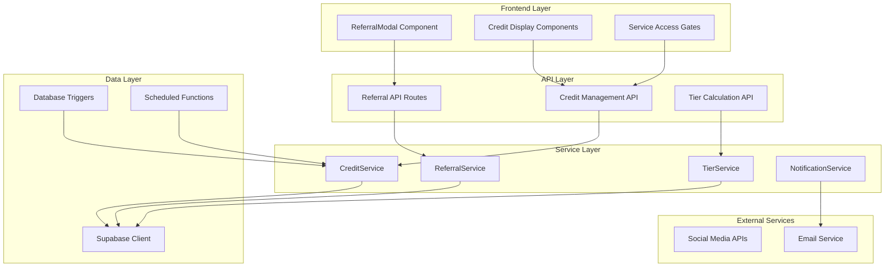

# Referral Credit System Design

## Overview

The Referral Credit System is a comprehensive solution that manages user credits, referral relationships, and tier-based rewards within the Tarana AI platform. The system leverages Supabase PostgreSQL for data persistence, implements real-time credit tracking, and provides a seamless user experience through the existing React/Next.js frontend.

## Architecture

### High-Level Architecture



### Component Relationships

The system follows a layered architecture with clear separation of concerns:
- **Frontend Layer**: React components for user interaction
- **API Layer**: Next.js API routes handling HTTP requests
- **Service Layer**: Business logic and data processing
- **Data Layer**: Supabase integration and database operations

## Components and Interfaces

### Database Schema

#### Users Table Enhancement
```sql
-- Extend existing users table or create user_profiles
CREATE TABLE user_profiles (
    id UUID PRIMARY KEY REFERENCES auth.users(id),
    referral_code VARCHAR(10) UNIQUE NOT NULL,
    current_tier VARCHAR(20) DEFAULT 'Default',
    daily_credits INTEGER DEFAULT 5,
    credits_used_today INTEGER DEFAULT 0,
    total_referrals INTEGER DEFAULT 0,
    active_referrals INTEGER DEFAULT 0,
    last_credit_refresh TIMESTAMP WITH TIME ZONE DEFAULT NOW(),
    created_at TIMESTAMP WITH TIME ZONE DEFAULT NOW(),
    updated_at TIMESTAMP WITH TIME ZONE DEFAULT NOW()
);
```

#### Referrals Table
```sql
CREATE TABLE referrals (
    id UUID PRIMARY KEY DEFAULT gen_random_uuid(),
    referrer_id UUID REFERENCES user_profiles(id),
    referee_id UUID REFERENCES user_profiles(id),
    referral_code VARCHAR(10) NOT NULL,
    status VARCHAR(20) DEFAULT 'pending', -- pending, active, inactive
    bonus_credits_granted INTEGER DEFAULT 2,
    created_at TIMESTAMP WITH TIME ZONE DEFAULT NOW(),
    activated_at TIMESTAMP WITH TIME ZONE,
    UNIQUE(referrer_id, referee_id)
);
```

#### Credit Transactions Table
```sql
CREATE TABLE credit_transactions (
    id UUID PRIMARY KEY DEFAULT gen_random_uuid(),
    user_id UUID REFERENCES user_profiles(id),
    transaction_type VARCHAR(20) NOT NULL, -- earn, spend, refresh
    amount INTEGER NOT NULL,
    service_used VARCHAR(50), -- tarana_gala, tarana_eats
    description TEXT,
    created_at TIMESTAMP WITH TIME ZONE DEFAULT NOW()
);
```

#### Daily Credit Allocations Table
```sql
CREATE TABLE daily_credit_allocations (
    id UUID PRIMARY KEY DEFAULT gen_random_uuid(),
    user_id UUID REFERENCES user_profiles(id),
    allocation_date DATE NOT NULL,
    base_credits INTEGER DEFAULT 5,
    bonus_credits INTEGER DEFAULT 0,
    total_credits INTEGER GENERATED ALWAYS AS (base_credits + bonus_credits) STORED,
    tier VARCHAR(20) NOT NULL,
    created_at TIMESTAMP WITH TIME ZONE DEFAULT NOW(),
    UNIQUE(user_id, allocation_date)
);
```

### Core Services

#### ReferralService
```typescript
interface ReferralService {
  generateReferralCode(): Promise<string>;
  createReferral(referrerCode: string, newUserId: string): Promise<ReferralResult>;
  getReferralStats(userId: string): Promise<ReferralStats>;
  validateReferralCode(code: string): Promise<boolean>;
  getActiveReferrals(userId: string): Promise<Referral[]>;
  updateReferralStatus(referralId: string, status: ReferralStatus): Promise<void>;
}

interface ReferralResult {
  success: boolean;
  referralId?: string;
  bonusCredits?: number;
  error?: string;
}

interface ReferralStats {
  totalReferrals: number;
  activeReferrals: number;
  currentTier: string;
  nextTierRequirement: number;
  totalBonusCredits: number;
}
```

#### CreditService
```typescript
interface CreditService {
  getCurrentBalance(userId: string): Promise<CreditBalance>;
  consumeCredits(userId: string, amount: number, service: string): Promise<ConsumeResult>;
  refreshDailyCredits(userId: string): Promise<RefreshResult>;
  calculateTierCredits(activeReferrals: number): Promise<TierCredits>;
  getCreditHistory(userId: string, limit?: number): Promise<CreditTransaction[]>;
}

interface CreditBalance {
  totalCredits: number;
  baseCredits: number;
  bonusCredits: number;
  usedToday: number;
  remainingToday: number;
  tier: string;
  nextRefresh: Date;
}

interface ConsumeResult {
  success: boolean;
  remainingCredits: number;
  error?: string;
}
```

#### TierService
```typescript
interface TierService {
  calculateUserTier(activeReferrals: number): Promise<UserTier>;
  updateUserTier(userId: string): Promise<TierUpdateResult>;
  getTierBenefits(tier: string): Promise<TierBenefits>;
  getAllTiers(): Promise<UserTier[]>;
}

interface UserTier {
  name: string;
  dailyCredits: number;
  requiredReferrals: number;
  benefits: string[];
  color: string;
  icon: string;
}

interface TierBenefits {
  dailyCredits: number;
  specialFeatures: string[];
  prioritySupport: boolean;
}
```

### API Endpoints

#### Referral Management
```typescript
// POST /api/referrals/create
interface CreateReferralRequest {
  referralCode: string;
  newUserEmail: string;
}

// GET /api/referrals/stats
interface ReferralStatsResponse {
  stats: ReferralStats;
  recentReferrals: Referral[];
  tierProgress: TierProgress;
}

// POST /api/referrals/validate
interface ValidateReferralRequest {
  code: string;
}
```

#### Credit Management
```typescript
// GET /api/credits/balance
interface CreditBalanceResponse {
  balance: CreditBalance;
  tierInfo: UserTier;
}

// POST /api/credits/consume
interface ConsumeCreditsRequest {
  service: 'tarana_gala' | 'tarana_eats';
  amount: number;
}

// POST /api/credits/refresh
interface RefreshCreditsResponse {
  newBalance: CreditBalance;
  refreshTime: Date;
}
```

## Data Models

### Core Entities

#### User Profile Model
```typescript
interface UserProfile {
  id: string;
  referralCode: string;
  currentTier: string;
  dailyCredits: number;
  creditsUsedToday: number;
  totalReferrals: number;
  activeReferrals: number;
  lastCreditRefresh: Date;
  createdAt: Date;
  updatedAt: Date;
}
```

#### Referral Model
```typescript
interface Referral {
  id: string;
  referrerId: string;
  refereeId: string;
  referralCode: string;
  status: 'pending' | 'active' | 'inactive';
  bonusCreditsGranted: number;
  createdAt: Date;
  activatedAt?: Date;
  refereeProfile?: {
    email: string;
    name: string;
    joinDate: Date;
  };
}
```

#### Credit Transaction Model
```typescript
interface CreditTransaction {
  id: string;
  userId: string;
  transactionType: 'earn' | 'spend' | 'refresh';
  amount: number;
  serviceUsed?: string;
  description: string;
  createdAt: Date;
}
```

## Error Handling

### Error Types and Recovery Strategies

#### Database Connection Errors
```typescript
class DatabaseConnectionError extends Error {
  constructor(message: string, public retryable: boolean = true) {
    super(message);
    this.name = 'DatabaseConnectionError';
  }
}

// Retry strategy with exponential backoff
const retryDatabaseOperation = async (operation: () => Promise<any>, maxRetries = 3) => {
  for (let attempt = 1; attempt <= maxRetries; attempt++) {
    try {
      return await operation();
    } catch (error) {
      if (attempt === maxRetries || !isRetryableError(error)) {
        throw error;
      }
      await delay(Math.pow(2, attempt) * 1000);
    }
  }
};
```

#### Credit Insufficient Errors
```typescript
class InsufficientCreditsError extends Error {
  constructor(
    public required: number,
    public available: number,
    public service: string
  ) {
    super(`Insufficient credits: need ${required}, have ${available} for ${service}`);
    this.name = 'InsufficientCreditsError';
  }
}
```

#### Referral Validation Errors
```typescript
class InvalidReferralCodeError extends Error {
  constructor(code: string) {
    super(`Invalid referral code: ${code}`);
    this.name = 'InvalidReferralCodeError';
  }
}

class SelfReferralError extends Error {
  constructor() {
    super('Users cannot refer themselves');
    this.name = 'SelfReferralError';
  }
}
```

### Error Handling Middleware
```typescript
const errorHandler = (error: Error, req: NextRequest, res: NextResponse) => {
  console.error('Referral System Error:', error);
  
  if (error instanceof InsufficientCreditsError) {
    return NextResponse.json({
      error: 'Insufficient credits',
      required: error.required,
      available: error.available,
      service: error.service
    }, { status: 402 });
  }
  
  if (error instanceof InvalidReferralCodeError) {
    return NextResponse.json({
      error: 'Invalid referral code',
      code: 'INVALID_REFERRAL'
    }, { status: 400 });
  }
  
  // Generic error response
  return NextResponse.json({
    error: 'Internal server error',
    code: 'INTERNAL_ERROR'
  }, { status: 500 });
};
```

## Testing Strategy

### Unit Testing Approach

#### Service Layer Tests
```typescript
describe('CreditService', () => {
  test('should calculate correct tier credits', async () => {
    const creditService = new CreditService();
    
    expect(await creditService.calculateTierCredits(0)).toEqual({
      tier: 'Default',
      dailyCredits: 5
    });
    
    expect(await creditService.calculateTierCredits(1)).toEqual({
      tier: 'Explorer',
      dailyCredits: 6
    });
    
    expect(await creditService.calculateTierCredits(5)).toEqual({
      tier: 'Voyager',
      dailyCredits: 10
    });
  });
  
  test('should handle credit consumption correctly', async () => {
    const result = await creditService.consumeCredits('user-123', 1, 'tarana_gala');
    expect(result.success).toBe(true);
    expect(result.remainingCredits).toBe(4);
  });
});
```

#### Database Integration Tests
```typescript
describe('Database Operations', () => {
  test('should create referral relationship', async () => {
    const referral = await createReferral('REF123', 'new-user-id');
    expect(referral.success).toBe(true);
    expect(referral.bonusCredits).toBe(2);
  });
  
  test('should handle duplicate referrals gracefully', async () => {
    await expect(createReferral('REF123', 'existing-user-id'))
      .rejects.toThrow('Referral already exists');
  });
});
```

### Integration Testing

#### API Endpoint Tests
```typescript
describe('Referral API', () => {
  test('POST /api/referrals/create should create valid referral', async () => {
    const response = await request(app)
      .post('/api/referrals/create')
      .send({ referralCode: 'TEST123', newUserEmail: 'test@example.com' })
      .expect(200);
    
    expect(response.body.success).toBe(true);
    expect(response.body.bonusCredits).toBe(2);
  });
});
```

### End-to-End Testing

#### User Journey Tests
```typescript
describe('Complete Referral Flow', () => {
  test('should complete full referral and credit earning cycle', async () => {
    // 1. User A generates referral code
    const userA = await createTestUser();
    const referralCode = userA.referralCode;
    
    // 2. User B signs up with referral code
    const userB = await signUpWithReferral(referralCode);
    expect(userB.dailyCredits).toBe(7); // 5 base + 2 bonus
    
    // 3. User A should get tier upgrade
    const updatedUserA = await getUserProfile(userA.id);
    expect(updatedUserA.currentTier).toBe('Explorer');
    expect(updatedUserA.dailyCredits).toBe(6);
  });
});
```

### Performance Testing

#### Load Testing Strategy
```typescript
describe('Performance Tests', () => {
  test('should handle concurrent credit consumption', async () => {
    const promises = Array(100).fill(0).map(() => 
      consumeCredits('user-123', 1, 'tarana_gala')
    );
    
    const results = await Promise.allSettled(promises);
    const successful = results.filter(r => r.status === 'fulfilled').length;
    
    // Only one should succeed due to credit limits
    expect(successful).toBe(1);
  });
});
```

### Database Testing

#### Migration Tests
```typescript
describe('Database Migrations', () => {
  test('should migrate existing users to new schema', async () => {
    // Test migration script
    await runMigration('add_referral_system');
    
    const users = await supabase.from('user_profiles').select('*');
    users.data?.forEach(user => {
      expect(user.referral_code).toBeDefined();
      expect(user.daily_credits).toBe(5);
    });
  });
});
```

## Implementation Considerations

### Real-time Updates
- Implement WebSocket connections for real-time credit balance updates
- Use Supabase real-time subscriptions for referral activity notifications
- Ensure UI reflects credit changes immediately after consumption

### Caching Strategy
- Cache user tier information in Redis for fast access
- Implement cache invalidation when referral counts change
- Use browser localStorage for temporary credit balance caching

### Security Measures
- Implement rate limiting on referral code generation
- Validate all referral operations server-side
- Use Supabase RLS policies for data access control
- Encrypt sensitive referral data in transit and at rest

### Scalability Considerations
- Design for horizontal scaling of API services
- Implement database connection pooling
- Use background jobs for credit refresh operations
- Consider sharding strategies for large user bases

### Monitoring and Analytics
- Track referral conversion rates and user engagement
- Monitor credit consumption patterns across services
- Implement alerting for system anomalies
- Create dashboards for business metrics tracking