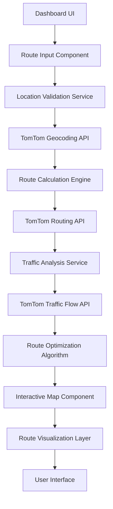

# Interactive Route Optimization System Design

## Overview

The Interactive Route Optimization System is a sophisticated traffic-aware routing solution that integrates seamlessly into the Tarana.ai dashboard. This system leverages TomTom's Routing API, Map Display API, and Geocoding API to provide users with optimal routes that actively avoid traffic congestion while displaying real-time traffic conditions and alternative path recommendations.

**Key Objectives:**
- Provide real-time optimal routing between locations in Baguio City
- Visualize traffic conditions with color-coded route segments
- Offer alternative routes based on current traffic conditions
- Integrate seamlessly below the "Suggested Spots" section in the dashboard
- Support waypoint optimization for multi-destination trips
- Enable route sharing and saving functionality

## Technology Stack & Architecture

### Frontend Framework Integration
- **React 19** with TypeScript for component development
- **Tailwind CSS** for responsive styling matching existing dashboard aesthetics
- **Next.js App Router** for optimized client-server communication
- **TomTom Maps SDK for Web** for advanced mapping and routing visualization

### Backend API Integration
- **TomTom Routing API v1** for route calculation and optimization
- **TomTom Traffic Flow API** for real-time traffic data integration
- **TomTom Geocoding API** for location search and coordinate resolution
- **Existing TomTom Traffic Service** enhancement for route-specific data

### Data Flow Architecture


## Component Architecture

### Core Components Hierarchy

#### 1. RouteOptimizationWidget
**Location:** `src/app/dashboard/components/RouteOptimizationWidget.tsx`
- Primary container component positioned below SuggestedSpots
- Manages overall state and coordinates child components
- Handles responsive layout adaptation

#### 2. RouteInputPanel
**Location:** `src/app/dashboard/components/route/RouteInputPanel.tsx`
- Origin and destination input fields with autocomplete
- Location search using TomTom geocoding
- Waypoint management for multi-stop routes
- Travel preferences (fastest, shortest, eco-friendly)

#### 3. InteractiveRouteMap
**Location:** `src/app/dashboard/components/route/InteractiveRouteMap.tsx`
- TomTom Maps integration with custom styling
- Real-time route visualization with traffic overlay
- Interactive waypoint manipulation
- Alternative route display with traffic differentiation

#### 4. RouteDetailsPanel
**Location:** `src/app/dashboard/components/route/RouteDetailsPanel.tsx`
- Route summary with estimated time and distance
- Traffic condition indicators
- Turn-by-turn directions preview
- Route saving and sharing functionality

#### 5. TrafficAnalysisService
**Location:** `src/lib/services/routeTrafficAnalysis.ts`
- Enhanced version of existing TomTom traffic service
- Route-specific traffic analysis
- Alternative route evaluation
- Real-time traffic monitoring for active routes

### Component Props & State Management

#### RouteOptimizationWidget State
```typescript
interface RouteOptimizationState {
  currentRoute: RouteData | null;
  alternativeRoutes: RouteData[];
  routePreferences: RoutePreferences;
  trafficConditions: TrafficCondition[];
  isCalculating: boolean;
  mapCenter: Coordinates;
  mapZoom: number;
  selectedWaypoints: LocationPoint[];
}
```

#### Route Data Structure
```typescript
interface RouteData {
  id: string;
  summary: RouteSummary;
  legs: RouteLeg[];
  geometry: RouteGeometry;
  trafficAnalysis: RouteTrafficAnalysis;
  instructions: RouteInstruction[];
  alternativeRank?: number;
}

interface RouteSummary {
  lengthInMeters: number;
  travelTimeInSeconds: number;
  trafficDelayInSeconds: number;
  departureTime: string;
  arrivalTime: string;
  routeType: 'fastest' | 'shortest' | 'eco' | 'thrilling';
}
```

## API Integration Layer

### TomTom Routing API Integration

#### Route Calculation Service
**File:** `src/lib/services/tomtomRouting.ts`

```typescript
interface TomTomRoutingConfig {
  apiKey: string;
  baseUrl: string;
  version: string;
  timeout: number;
}

class TomTomRoutingService {
  // Calculate optimal route with traffic awareness
  async calculateRoute(request: RouteRequest): Promise<RouteResponse>;
  
  // Get alternative routes for comparison
  async getAlternativeRoutes(request: RouteRequest): Promise<RouteResponse[]>;
  
  // Calculate route matrix for multiple destinations
  async calculateRouteMatrix(origins: Location[], destinations: Location[]): Promise<RouteMatrix>;
  
  // Real-time route monitoring with traffic updates
  async monitorRoute(routeId: string): Promise<RouteMonitoringData>;
}
```

#### Geocoding Integration
**File:** `src/lib/services/tomtomGeocoding.ts`

```typescript
class TomTomGeocodingService {
  // Search locations with autocomplete
  async searchLocations(query: string, bounds?: BoundingBox): Promise<SearchResult[]>;
  
  // Reverse geocoding for coordinates to address
  async reverseGeocode(coordinates: Coordinates): Promise<AddressResult>;
  
  // Batch geocoding for multiple locations
  async batchGeocode(addresses: string[]): Promise<GeocodeResult[]>;
}
```

### Traffic-Aware Route Optimization

#### Enhanced Traffic Analysis
**File:** `src/lib/services/routeTrafficAnalysis.ts`

```typescript
interface RouteTrafficAnalysis {
  overallTrafficLevel: TrafficLevel;
  segmentAnalysis: RouteSegmentTraffic[];
  estimatedDelay: number;
  alternativeRecommendation: boolean;
  peakHourImpact: PeakHourAnalysis;
  historicalComparison: TrafficHistoryData;
}

class RouteTrafficAnalyzer {
  // Analyze traffic for complete route
  async analyzeRouteTraffic(route: RouteData): Promise<RouteTrafficAnalysis>;
  
  // Compare multiple routes for traffic efficiency
  async compareRouteTraffic(routes: RouteData[]): Promise<RouteComparison>;
  
  // Predict traffic for future departure times
  async predictTrafficConditions(route: RouteData, departureTime: Date): Promise<TrafficPrediction>;
}
```

### Backend API Endpoints

#### Route Management API
**File:** `src/app/api/routes/calculate/route.ts`
- **POST** `/api/routes/calculate` - Calculate optimal route with traffic analysis
- **GET** `/api/routes/alternatives` - Get alternative routes for comparison
- **POST** `/api/routes/monitor` - Start real-time route monitoring

#### Location Services API
**File:** `src/app/api/locations/search/route.ts`
- **GET** `/api/locations/search` - Search locations with autocomplete
- **POST** `/api/locations/geocode` - Batch geocoding service
- **GET** `/api/locations/popular` - Get popular Baguio destinations

## Interactive Map Implementation

### TomTom Maps SDK Integration

#### Map Configuration
```typescript
interface RouteMapConfig {
  container: HTMLElement;
  key: string;
  center: [number, number];
  zoom: number;
  style: 'basic_main' | 'driving' | 'satellite';
  trafficFlow: boolean;
  trafficIncidents: boolean;
}
```

#### Map Visualization Features

##### Route Rendering
- **Primary Route:** Bold blue line with traffic-aware color coding
- **Alternative Routes:** Lighter gray lines with hover interaction
- **Traffic Overlay:** Color-coded segments (green/yellow/red/dark red)
- **Waypoint Markers:** Draggable pins for route customization

##### Interactive Elements
- **Click-to-Add Waypoints:** Users can click map to add intermediate stops
- **Drag-and-Drop Reordering:** Waypoints can be reordered by dragging
- **Route Information Popups:** Hover tooltips showing segment details
- **Traffic Incident Markers:** Real-time incident visualization

#### Map Event Handling
```typescript
interface MapEventHandlers {
  onRouteClick: (segment: RouteSegment) => void;
  onWaypointDrag: (waypoint: Waypoint, newPosition: Coordinates) => void;
  onMapClick: (coordinates: Coordinates) => void;
  onAlternativeRouteHover: (route: RouteData) => void;
}
```

### Real-Time Traffic Visualization

#### Traffic Flow Integration
- **Live Traffic Data:** 5-minute refresh intervals for current conditions
- **Historical Comparison:** Show typical traffic vs. current conditions
- **Predictive Analysis:** Future traffic estimates for planned departures
- **Incident Alerts:** Real-time notifications for route-affecting incidents

#### Visual Traffic Indicators
```typescript
interface TrafficVisualization {
  segmentColors: {
    free: '#4CAF50';      // Green - Free flowing traffic
    slow: '#FF9800';      // Orange - Slow traffic
    congested: '#F44336'; // Red - Heavy congestion
    blocked: '#9C27B0';   // Purple - Road closure/incident
  };
  
  lineWeights: {
    primary: 8;           // Primary route thickness
    alternative: 4;       // Alternative route thickness
    traffic: 6;           // Traffic overlay thickness
  };
}
```

## User Interface Design

### Layout Integration with Dashboard

#### Positioning Strategy
The RouteOptimizationWidget will be positioned between existing dashboard sections:
1. **Above:** SuggestedSpots component
2. **Below:** Interactive Route Optimization Widget (new)
3. **Below:** RecommendedCafes component

#### Responsive Design Specifications
```css
/* Desktop Layout (md:) */
.route-optimization-container {
  @apply grid grid-cols-12 gap-6 mb-8;
}

.route-input-panel {
  @apply col-span-4 bg-white rounded-2xl border-2 border-gray-200 p-6;
}

.route-map-container {
  @apply col-span-8 bg-white rounded-2xl border-2 border-gray-200 p-4;
}

/* Tablet Layout (sm:) */
@media (max-width: 768px) {
  .route-optimization-container {
    @apply grid-cols-1 gap-4;
  }
  
  .route-input-panel,
  .route-map-container {
    @apply col-span-1;
  }
}
```

### Input Controls Design

#### Location Input Fields
- **Origin Field:** Auto-populated with user's current location or last used location
- **Destination Field:** Autocomplete with Baguio landmarks and popular destinations
- **Waypoint Fields:** Dynamic add/remove with drag-to-reorder functionality
- **Route Preferences:** Toggle buttons for route type selection

#### Visual Design Consistency
```css
.route-input-field {
  @apply w-full px-4 py-3 border border-gray-300 rounded-lg focus:ring-2 focus:ring-blue-500 focus:border-transparent;
}

.route-preference-toggle {
  @apply px-4 py-2 text-sm font-medium rounded-lg border border-gray-300 hover:bg-gray-50;
}

.route-preference-toggle.active {
  @apply bg-blue-500 text-white border-blue-500;
}
```

### Route Information Display

#### Route Summary Card
```typescript
interface RouteSummaryCardProps {
  route: RouteData;
  trafficAnalysis: RouteTrafficAnalysis;
  isSelected: boolean;
  onSelect: () => void;
}
```

#### Traffic Status Indicators
- **Visual Icons:** Traffic light metaphor (green/yellow/red)
- **Estimated Time:** Current time vs. free-flow time comparison
- **Delay Indicators:** Color-coded delay warnings
- **Alternative Route Suggestions:** Proactive recommendations

## Data Models & Types

### Core Route Data Structures

#### Location and Coordinate Types
```typescript
interface Coordinates {
  lat: number;
  lng: number;
}

interface LocationPoint extends Coordinates {
  id: string;
  name: string;
  address: string;
  category?: string;
  placeId?: string;
}

interface BoundingBox {
  topLeft: Coordinates;
  bottomRight: Coordinates;
}
```

#### Route Calculation Types
```typescript
interface RouteRequest {
  locations: LocationPoint[];
  routeType: 'fastest' | 'shortest' | 'eco' | 'thrilling';
  departureTime?: Date;
  avoidTolls?: boolean;
  avoidHighways?: boolean;
  avoidFerries?: boolean;
  vehicleType?: 'car' | 'truck' | 'motorcycle' | 'bicycle';
}

interface RouteInstruction {
  instruction: string;
  distance: number;
  time: number;
  coordinates: Coordinates;
  maneuver: string;
  streetName: string;
}
```

#### Traffic Analysis Types
```typescript
interface RouteSegmentTraffic {
  segmentId: string;
  startCoordinate: Coordinates;
  endCoordinate: Coordinates;
  trafficLevel: TrafficLevel;
  speedKmh: number;
  freeFlowSpeedKmh: number;
  delaySeconds: number;
  incidents: TrafficIncident[];
}

interface RouteComparison {
  routes: RouteData[];
  recommendation: {
    primaryRouteId: string;
    reason: string;
    timeSavings: number;
    trafficAdvantage: string;
  };
}
```

## Business Logic Layer

### Route Optimization Algorithm

#### Multi-Criteria Decision Analysis
```typescript
interface RouteEvaluationCriteria {
  travelTime: number;          // Weight: 40%
  trafficConditions: number;   // Weight: 30%
  distance: number;            // Weight: 20%
  roadQuality: number;         // Weight: 10%
}

class RouteOptimizer {
  // Evaluate and rank multiple route options
  evaluateRoutes(routes: RouteData[], criteria: RouteEvaluationCriteria): RouteRanking[];
  
  // Real-time route adaptation based on changing traffic
  adaptRouteForTraffic(currentRoute: RouteData, trafficUpdate: TrafficUpdate): RouteData;
  
  // Optimize waypoint order for efficiency
  optimizeWaypointOrder(waypoints: LocationPoint[]): LocationPoint[];
}
```

#### Intelligent Route Selection
- **Dynamic Re-routing:** Automatic alternative suggestions when traffic conditions change
- **Predictive Analysis:** Route recommendations based on typical traffic patterns
- **User Preference Learning:** Adapt recommendations based on user route history
- **Context-Aware Suggestions:** Consider weather, events, and time of day

### Caching and Performance Optimization

#### Route Data Caching Strategy
```typescript
interface RouteCacheConfig {
  routeDuration: number;        // 5 minutes for route data
  trafficDuration: number;      // 2 minutes for traffic data
  geocodeDuration: number;      // 1 hour for geocoding results
  maxCacheSize: number;         // 100 routes maximum
}

class RouteCache {
  // Cache route calculations to reduce API calls
  cacheRoute(routeRequest: RouteRequest, routeData: RouteData): void;
  
  // Retrieve cached route if still valid
  getCachedRoute(routeRequest: RouteRequest): RouteData | null;
  
  // Update cached route with new traffic data
  updateRouteTraffic(routeId: string, trafficData: TrafficUpdate): void;
}
```

## API Endpoint Specifications

### Route Calculation Endpoints

#### Calculate Route
```typescript
// POST /api/routes/calculate
interface CalculateRouteRequest {
  origin: LocationPoint;
  destination: LocationPoint;
  waypoints?: LocationPoint[];
  preferences: RoutePreferences;
  departureTime?: string;
}

interface CalculateRouteResponse {
  primaryRoute: RouteData;
  alternativeRoutes: RouteData[];
  trafficAnalysis: RouteTrafficAnalysis;
  recommendations: RouteRecommendation[];
}
```

#### Route Monitoring
```typescript
// POST /api/routes/monitor
interface RouteMonitorRequest {
  routeId: string;
  monitoringDuration: number; // minutes
  alertThresholds: {
    delayMinutes: number;
    trafficLevelChange: boolean;
  };
}

interface RouteMonitorResponse {
  monitoringId: string;
  currentStatus: RouteStatus;
  estimatedUpdates: Date[];
}
```

### Location Services Endpoints

#### Location Search
```typescript
// GET /api/locations/search?q={query}&bounds={bounds}
interface LocationSearchResponse {
  results: SearchResult[];
  suggestions: string[];
  bounds: BoundingBox;
}

interface SearchResult {
  id: string;
  name: string;
  address: string;
  coordinates: Coordinates;
  category: string;
  relevanceScore: number;
  popularityIndex: number;
}
```

## Real-Time Features

### Live Traffic Monitoring

#### WebSocket Integration
```typescript
interface TrafficWebSocketEvents {
  'traffic-update': (data: TrafficUpdate) => void;
  'route-alert': (alert: RouteAlert) => void;
  'incident-notification': (incident: TrafficIncident) => void;
}

class RouteMonitoringService {
  // Subscribe to real-time traffic updates for active route
  subscribeToRoute(routeId: string): WebSocket;
  
  // Handle incoming traffic updates
  handleTrafficUpdate(update: TrafficUpdate): void;
  
  // Send proactive notifications to user
  sendRouteAlert(alert: RouteAlert): void;
}
```

#### Automatic Route Updates
- **Traffic Threshold Monitoring:** Detect when traffic conditions significantly change
- **Alternative Route Suggestions:** Proactively suggest better routes
- **ETA Updates:** Real-time arrival time adjustments
- **Incident Notifications:** Alert users to accidents, closures, or construction

### Progressive Enhancement

#### Offline Capability
```typescript
interface OfflineRouteData {
  cachedRoutes: RouteData[];
  lastTrafficUpdate: Date;
  fallbackDirections: RouteInstruction[];
  estimatedAccuracy: number;
}

class OfflineRouteService {
  // Cache essential route data for offline use
  cacheRouteForOffline(route: RouteData): void;
  
  // Provide basic routing when network unavailable
  getOfflineRoute(origin: Coordinates, destination: Coordinates): RouteData | null;
  
  // Sync with server when connection restored
  syncOfflineChanges(): Promise<void>;
}
```

## Testing Strategy

### Unit Testing Specifications

#### Component Testing
```typescript
describe('RouteOptimizationWidget', () => {
  test('renders location input fields correctly');
  test('handles route calculation with traffic data');
  test('displays alternative routes appropriately');
  test('updates map visualization on route change');
  test('manages waypoint addition and removal');
});

describe('TomTomRoutingService', () => {
  test('calculates route with proper API integration');
  test('handles API errors gracefully');
  test('caches route data efficiently');
  test('integrates traffic analysis correctly');
});
```

#### Integration Testing
- **API Integration Tests:** Verify TomTom API responses and error handling
- **Map Rendering Tests:** Ensure proper map visualization and interaction
- **Traffic Data Integration:** Validate real-time traffic data processing
- **Route Optimization Tests:** Confirm algorithm accuracy and performance

#### End-to-End Testing
```typescript
describe('Route Optimization E2E', () => {
  test('Complete route planning workflow');
  test('Real-time traffic adaptation');
  test('Multi-device responsive behavior');
  test('Route saving and sharing functionality');
});
```

### Performance Testing

#### Load Testing Scenarios
- **Concurrent Route Calculations:** Test system under high user load
- **API Rate Limiting:** Verify graceful handling of API limits
- **Map Rendering Performance:** Ensure smooth interaction with complex routes
- **Memory Usage Optimization:** Monitor component memory consumption

#### Performance Benchmarks
```typescript
interface PerformanceBenchmarks {
  routeCalculation: {
    maxResponseTime: 3000; // milliseconds
    averageResponseTime: 1500;
  };
  
  mapRendering: {
    initialLoadTime: 2000;
    routeUpdateTime: 500;
  };
  
  trafficDataUpdate: {
    updateFrequency: 120000; // 2 minutes
    maxUpdateTime: 1000;
  };
}
```

## Security Considerations

### API Key Management
```typescript
interface APISecurityConfig {
  tomtomApiKey: string;          // Server-side only
  hereApiKey: string;            // Client-side with domain restrictions
  rateLimitPerUser: number;      // 100 requests per hour
  rateLimitPerIP: number;        // 500 requests per hour
}
```

### Data Privacy and Protection
- **Location Data Handling:** Implement privacy-compliant location storage
- **Route History:** Optional user-controlled route saving with encryption
- **API Request Logging:** Secure logging without exposing sensitive data
- **CORS Configuration:** Proper cross-origin request handling

### Input Validation and Sanitization
```typescript
class RouteInputValidator {
  // Validate coordinate bounds within Baguio area
  validateCoordinates(coords: Coordinates): boolean;
  
  // Sanitize location search queries
  sanitizeSearchQuery(query: string): string;
  
  // Validate route preferences
  validateRoutePreferences(prefs: RoutePreferences): boolean;
}
```

## Implementation Phases

### Phase 1: Core Infrastructure (Weeks 1-2)
- TomTom API integration setup
- Basic route calculation service
- Enhanced coordinate database
- Route data models and types

### Phase 2: UI Components Development (Weeks 3-4)
- RouteOptimizationWidget container component
- RouteInputPanel with location search
- Basic InteractiveRouteMap implementation
- RouteDetailsPanel with summary display

### Phase 3: Advanced Features (Weeks 5-6)
- Real-time traffic integration
- Alternative route calculation
- Interactive map enhancements
- Route optimization algorithms

### Phase 4: Integration and Testing (Weeks 7-8)
- Dashboard integration and styling
- Comprehensive testing suite
- Performance optimization
- Documentation and deployment

## Deployment Configuration

### Environment Variables
```bash
# TomTom API Configuration
TOMTOM_API_KEY=your_tomtom_api_key
TOMTOM_ROUTING_API_URL=https://api.tomtom.com/routing/1
TOMTOM_TRAFFIC_API_URL=https://api.tomtom.com/traffic/services/4

# HERE Maps Configuration
NEXT_PUBLIC_HERE_MAPS_API_KEY=your_here_maps_api_key

# Route Optimization Settings
ROUTE_CACHE_DURATION=300000
MAX_ALTERNATIVE_ROUTES=3
TRAFFIC_UPDATE_INTERVAL=120000
```

### Production Deployment
- **Vercel Configuration:** Updated build settings for TomTom SDK
- **CDN Integration:** Optimized asset delivery for map tiles
- **Monitoring Setup:** Performance tracking and error reporting
- **Backup Systems:** Fallback routing when APIs unavailable

## Future Enhancement Roadmap

### Short-term Enhancements (3-6 months)
- Voice-guided navigation integration
- Public transportation routing options
- Bike and walking route optimization
- Social route sharing features

### Long-term Vision (6-12 months)
- AI-powered route learning and prediction
- Integration with local event calendars
- Carbon footprint tracking and eco-routing
- Multi-modal transportation planning

### Integration Opportunities
- **Itinerary Generator:** Connect optimal routing with trip planning
- **Tarana Eats:** Route optimization for food delivery and restaurant visits
- **Weather Integration:** Weather-aware route recommendations
- **User Preferences:** Personalized routing based on travel history