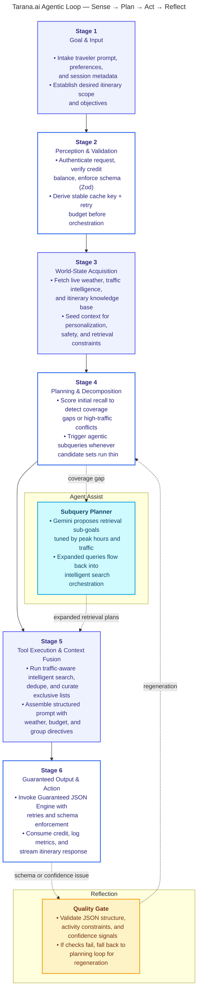

```mermaid
---
title: Tarana.ai Agentic Loop — Sense → Plan → Act → Reflect
---
flowchart TB
    %% ── Nodes ──
    S1["<b>Stage 1</b><br/>Goal & Input<br/><br/>• Intake traveler prompt, preferences,<br/>  and session metadata<br/>• Establish desired itinerary scope<br/>  and objectives"]
    S2["<b>Stage 2</b><br/>Perception & Validation<br/>• Authenticate request, verify credit<br/>  balance, enforce schema (Zod)<br/>• Derive stable cache key + retry<br/>  budget before orchestration"]
    S3["<b>Stage 3</b><br/>World-State Acquisition<br/>• Fetch live weather, traffic intelligence,<br/>  and itinerary knowledge base<br/>• Seed context for personalization,<br/>  safety, and retrieval constraints"]
    S4["<b>Stage 4</b><br/>Planning & Decomposition<br/>• Score initial recall to detect coverage<br/>  gaps or high-traffic conflicts<br/>• Trigger agentic subqueries whenever<br/>  candidate sets run thin"]
    S5["<b>Stage 5</b><br/>Tool Execution & Context Fusion<br/>• Run traffic-aware intelligent search,<br/>  dedupe, and curate exclusive lists<br/>• Assemble structured prompt with<br/>  weather, budget, and group directives"]
    S6["<b>Stage 6</b><br/>Guaranteed Output & Action<br/>• Invoke Guaranteed JSON Engine with<br/>  retries and schema enforcement<br/>• Consume credit, log metrics, and<br/>  stream itinerary response"]

    subgraph AS ["Agent Assist"]
      A1["<b>Subquery Planner</b><br/>• Gemini proposes retrieval sub-goals<br/>  tuned by peak hours and traffic<br/>• Expanded queries flow back into<br/>  intelligent search orchestration"]
    end

    subgraph RF ["Reflection"]
      QG["<b>Quality Gate</b><br/>• Validate JSON structure,<br/>  activity constraints, and<br/>  confidence signals<br/>• If checks fail, fall back to<br/>  planning loop for regeneration"]
    end

    %% ── Primary flow ──
    S1 --> S2 --> S3 --> S4 --> S5 --> S6

    %% ── Agent-assisted branching ──
    S4 -.->|"coverage gap"| A1
    A1 -.->|"expanded retrieval plans"| S5

    %% ── Reflection / observation loop ──
    S6 -.->|"schema or confidence issue"| QG
    QG -.->|"regeneration"| S4

    %% ── Styles ──
    style S1 fill:#eef2ff,stroke:#6366f1,stroke-width:2px,color:#312e81
    style S2 fill:#ffffff,stroke:#2563eb,stroke-width:2px,color:#312e81
    style S3 fill:#eef2ff,stroke:#6366f1,stroke-width:2px,color:#312e81
    style S4 fill:#ffffff,stroke:#2563eb,stroke-width:2px,color:#312e81
    style S5 fill:#eef2ff,stroke:#6366f1,stroke-width:2px,color:#312e81
    style S6 fill:#ffffff,stroke:#2563eb,stroke-width:2px,color:#312e81
    style A1 fill:#cffafe,stroke:#0ea5e9,stroke-width:2px,color:#0c4a6e
    style QG fill:#fef3c7,stroke:#f59e0b,stroke-width:2px,color:#78350f
```