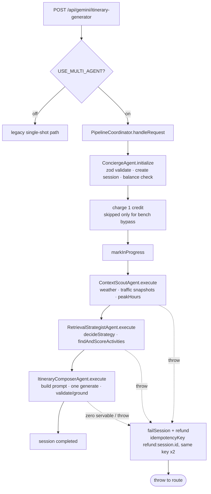
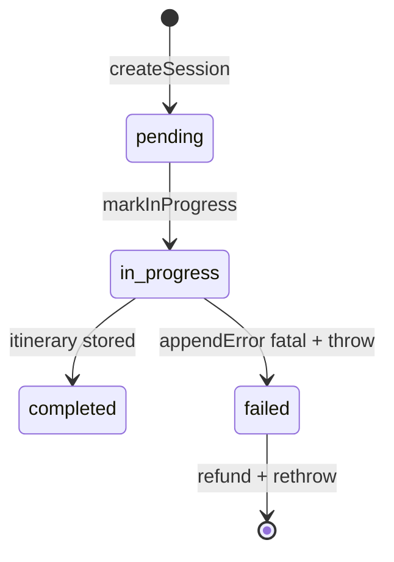

# Tarana Gala agent architecture

- **Status:** Accepted (describes code on `main` as of PR #710)
- **Date:** 2026-10-07
- **Scope:** `POST /api/gemini/itinerary-generator` multi-agent path only. Legacy single-shot path, Explore plan mode, and Eats are out of scope.
- **Related:** ADR-003 (multi-agent behind `USE_MULTI_AGENT` flag), ADR-004 (credit gating), ADR-009 (feedback edge — proposed, **not implemented**).

## Request lifecycle

Charge happens once, upstream of all generation. Refund reuses one idempotency key (ADR-004); no stage may add a charge.

## Session states

Store is an in-memory `Map` (`src/lib/agentic/sessionStore.ts`) — no persistence; a cold start loses sessions. Session carries `context`, `retrieval` (candidates + strategy + reason), `itinerary`, and `errors`.

## Components

| Component | File | Input | Output | Decides? |
|---|---|---|---|---|
| `PipelineCoordinator` | `src/agents/pipelineCoordinator.ts` | `NextRequest` | `RequestSession` | No — fixed order, charge/refund only |
| `ConciergeAgent` | `src/agents/conciergeAgent.ts` | request | validated session + preferences | No — validate + record |
| `ContextScoutAgent` | `src/agents/contextScoutAgent.ts` | session + body | weather, traffic, peakHours on session | No — fetch + record |
| `RetrievalStrategistAgent` | `src/agents/retrievalStrategistAgent.ts` | session | ranked candidates + strategy metadata | **Yes — `decideStrategy()`** |
| `ItineraryComposerAgent` | `src/agents/itineraryComposerAgent.ts` | session | grounded itinerary | No — generate + validate |

## The one decision

`decideStrategy()` selects from a closed catalog on scope + request shape, before any search runs. No model call, no I/O.

| Scope + request | Strategy | Meaning |
|---|---|---|
| `baguio`, no interests | `curated` | deterministic catalog, skip upstream |
| `baguio` + interests | `interest-first` | personalization layer leads |
| strict-city members | `tomtom-live` | shared TomTom pool is the only ground |
| `ph-wide` / `world` / unknown | `honest-empty` | no pool; never borrow another city |
| missing city | baguio default | same as first matching row |

The session records the decision, its reason, and the `observedSearchMethod` the search layer actually took.

## Known limits (verified, not aspirational)

- **No feedback edge.** Grounding failure throws → refund. There is no retry, no narrowed re-query. ADR-009 records that design as optional and unimplemented.
- **Traffic locations are Baguio-hardcoded.** `DEFAULT_TRAFFIC_LOCATIONS` (Burnham Park, Baguio Public Market, Mines View) feeds every scope including Cebu. Parameterizing a field with zero downstream consumers would be dead code; left as-is deliberately.
- **One LLM call per request** (inside the composer; its engine owns retries). The pipeline adds no model calls.
- **Legacy path retained** as the flag-off rollback target (ADR-003). Do not delete it in a pipeline PR.
