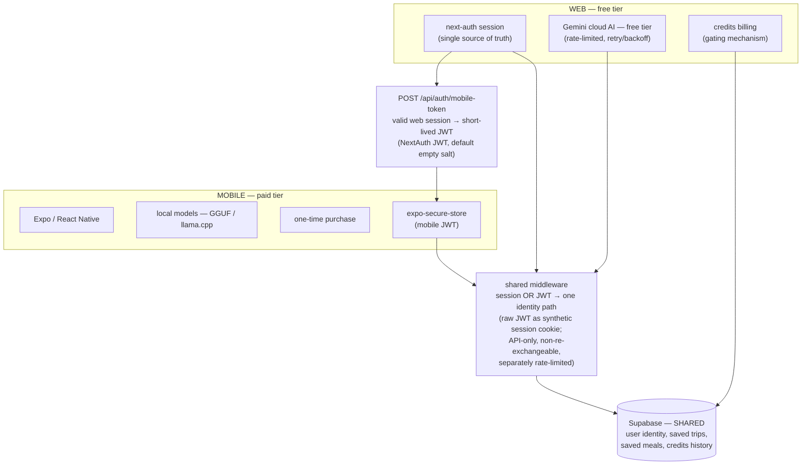
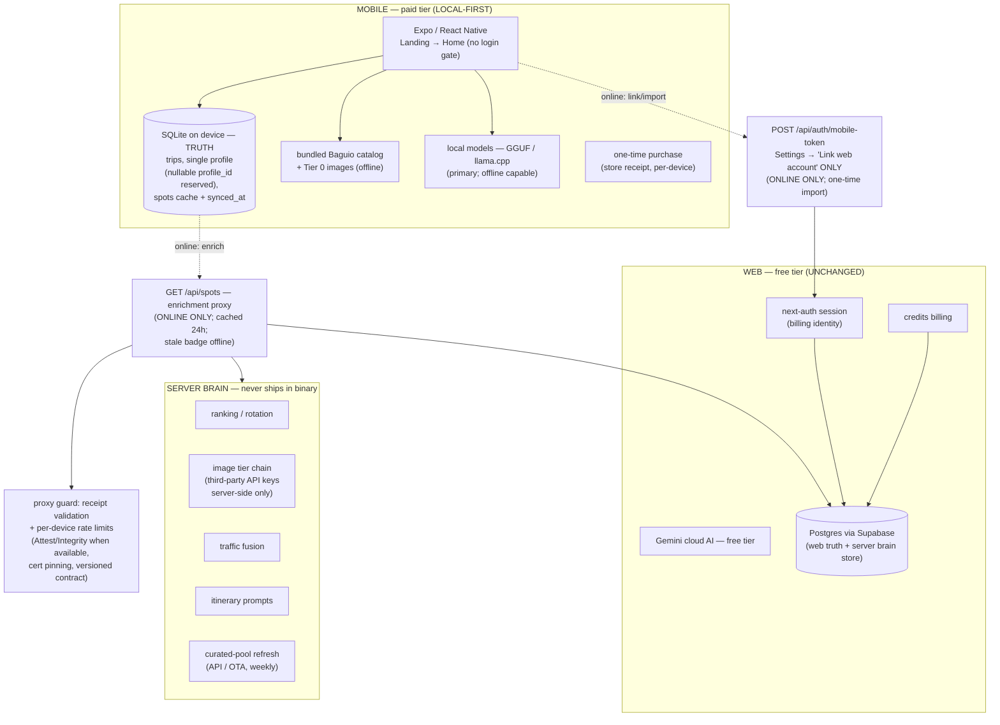

# Tarana Mobile App — Implementation Plan

**Status:** Phase 1 complete (2026-09-09, PR #388) | **Phase 3 complete** — toolchain (#397), navigation + NativeWind (#398), saved-trips + spots screens (#399) all merged; simulator run done 2026-09-11 | **Phase 3b (2026-09-10):** mobile landing page + sign-in/sign-up screens mirroring web UI/UX — **implemented + verified (tsc clean, Metro bundle green, re-verified 2026-09-11)** | **Amendment 2026-09-12 (§7, ADR-002 Proposed):** local-first pivot under review — core loop to SQLite, no login gate; server retained as enrichment proxy + optional sync | **Mode:** Build
**Scope:** Paid mobile app (Expo/React Native) with on-device local LLMs. Web app remains free tier (credits, rate-limited free Gemini). Freemium: web = funnel, mobile = premium.
**Depends on:** `next-auth` (web source of truth, unchanged), Supabase Postgres (server brain + enrichment proxy), free Gemini (`GOOGLE_GEMINI_API_KEY`), SQLite on device (`expo-sqlite`, §2.1)

---

## 1. Verified facts (evidence-backed)

| Fact | Evidence |
|---|---|
| Free Gemini only, no paid tier | `src/lib/ai/embeddings.ts:13` — `GOOGLE_GEMINI_API_KEY`, `@google/genai` |
| Rate limiting is operational, not hypothetical | 429 handling + exponential backoff across `src/app/api/locations/search/route.ts:75`, `src/app/api/routes/calculate/route.ts:147`, `src/lib/auth/auth.ts:236`, `src/app/api/gemini/itinerary-generator/lib/errorHandler.ts:62`, `responseHandler.ts:29`; TomTom batching comment at `trafficAwareActivitySearch.ts:47` ("was 40 → 429s") |
| `next-auth` at 100+ sites, 40 files, 3 APIs | grep across `src/lib/auth`, `src/lib/data/savedItineraries.ts`, `src/middleware/auth.ts`, `src/agents/conciergeAgent.ts`, ~20 API routes, ~15 client components |
| Not a monorepo | No `pnpm-workspace.yaml`, `lerna.json`, `turborepo.json`, `rush.json`; no `"workspaces"` in `package.json` |
| Two apps: Next.js 15 + orphaned Vite SPA | `src/app/` vs `src/App.tsx` + `index.html`; **no `vite.config.*`** — SPA may not build |
| Mobile scaffold + screens committed, simulator run done | `tarana-mobile/` tracked (Expo 57, AuthGate stack, Home placeholder, saved-trips + spots screens); commits through PRs #397 (toolchain), #398 (nav + NativeWind), #399 (screens). Simulator run completed 2026-09-11 — app boots to Landing on both platforms; signin → signup → signin round-trip works |
| No PWA | No `manifest.json`, no `sw.js` in `public/` |
| Eats spec 0% implemented (out of scope) | `specs/tarana-eats-city-scale-plan.md:3` |

---

## 2.0. Architecture (DEPRECATED — preserved for rollback, superseded by §2.1)

> **Status:** DEPRECATED as of 2026-09-12 (ADR-002). Kept intact so it can be restored. Do not delete. New work follows §2.1.

**One user. One database. One auth system.** The mobile app does not have its own auth or its own user records.

### Auth bridge (the load-bearing piece) ✅ Phase 1 implemented

`next-auth` has no React Native equivalent. Rather than a parallel auth system (two sources of truth for user identity — a real failure mode) or a 12-week refactor, add a token bridge:

1. **`POST /api/auth/mobile-token`** — validates a valid web `next-auth` session, returns a short-lived JWT.
2. **Shared middleware** — existing API routes already resolve user identity from the session; extend them to accept the JWT too. One identity path, not two.
3. **Mobile client** — store JWT in `expo-secure-store`. All subsequent API calls use it.

The token is a standard NextAuth JWT on the **default empty salt**, so it round-trips through `getToken`/`getServerSession` unchanged; the middleware injects the *raw encrypted JWT* (not the decoded user id) as a synthetic session cookie. Mobile tokens are API-only, cannot be re-exchanged, and are rate-limited separately from the global API limiter.

Result: web user logs in → requests a mobile token → opens mobile app → same trips, same credits, same history. One account, two surfaces.

### AI split

| Surface | AI | Cost | Rate limits |
|---|---|---|---|
| Web | Gemini cloud (`@google/genai`) | Free tier | Yes — handled by existing retry/backoff |
| Mobile | Local models (GGUF via llama.cpp / Core ML on iOS) | Free (device) | None — runs on device |

Mobile also supports **cloud fallback** when online, and **offline mode** using the local model. The local model is the primary path because the free Gemini tier cannot scale to mobile users.

---

## 2.1. Architecture (CURRENT — local-first shell + server brain, ADR-002)

**Device = SQLite truth. Server = Postgres brain.** Phone works airplane-mode for the full core loop (profile, trips CRUD, bundled spots, local LLM). Network makes it better (fresh POIs, photos, traffic, web import) — never gates it.

| Rule | Detail |
|---|---|
| No login for core loop | Landing → Home directly; `exchangeForMobileToken()` demoted to optional link/import |
| No server keys in binary | Supabase anon key out of `app.json extra`; `webBaseUrl` enrichment-only |
| Single profile v1 | Nullable `profile_id` reserved; multi-profile UI deferred (additive later) |
| Cache TTLs are cost controls | 24h images, per-city spots snapshot + `synced_at`; stale badge offline |
| Proxy hardened w/o login | Receipt validation, per-device rate limits, App Attest/Play Integrity when available, cert pinning, versioned contract |
| Web unchanged | `next-auth` + credits + Gemini stay (billing needs server identity) |

Rollback: §2.0 above is intact — restoring it means re-gating boot on the JWT bridge and Supabase queries. ADR-002 §Revisit triggers govern the call.

---

## 3. Freemium logic

The web app's credits and rate limits are **not a bug in this plan — they are the gating mechanism.** Free tier is supposed to be limited; that is what makes the paid mobile app worth buying.

- Web = free funnel, credits-gated, rate-limited cloud AI.
- Mobile = paid premium, local AI, no limits, offline.

---

## 4. Phased plan

### Phase 1 — Auth bridge (1 week) ✅ COMPLETE
- [x] `POST /api/auth/mobile-token` — validate web session, return short-lived JWT
- [x] Shared middleware extending existing routes to accept JWT
- [x] `expo-secure-store` client on mobile
- [x] Verify: web session → token → JWT accepted by an existing route

**Implementation:** `src/app/api/auth/mobile-token/route.ts`, `src/middleware/auth.ts`,
`src/lib/auth/mobileToken.ts`, `src/expo/auth/mobileTokenStore.ts`,
`src/lib/security/rateLimiter.ts`, `scripts/verify-mobile-token-bridge.ts`.
Merged to `main` as PR #388 (6 atomic commits, +1010/−20 lines).

**Verification:** 437 tests pass / 8 skipped / 0 failed · `tsc --noEmit` clean ·
`next build` compiles · ESLint 0 errors · mock-free runtime proof reports
`BRIDGE VERIFIED` (encode → `getToken` → `decode` round-trip through the
synthetic cookie). CI `verify` and Vercel preview both green.

**Deferred (out of scope):** exact TTL, refresh, durable revocation,
device-binding.

### Phase 2 — Local model validation (cheap experiment, before anything else)
- [ ] Run one itinerary through a local model (Gemma 3 / Qwen variant)
- [ ] Compare output to the equivalent Gemini response
- **This is the make-or-break.** If quality is unacceptable, the paid app has no product and the plan fails. If acceptable, proceed.
- Verify: side-by-side itinerary output, human review

### Phase 3 — Expo scaffold (2–3 weeks) — COMPLETE (2026-09-11)

| # | Task | Status |
|---|---|---|
| 3.1 | Expo 57 scaffold committed (`tarana-mobile/`: `app.json`, `App.tsx` auth screen, `src/auth.ts` exchange flow, `src/supabase.ts` anon-key wrapper, `src/config.ts`) | ✅ Done |
| 3.2 | Metro remap for shared web code (`tarana-mobile/metro.config.js` mirrors the `tarana-web/*` tsconfig alias; see Metro probe below) | ✅ Done |
| 3.3 | Removed dead signing-secret surface from mobile config (signing keys must never ship in the app binary) | ✅ Done |
| 3.4 | Toolchain unblock (#397): `babel-preset-expo` installed + `babel.config.js`, `app.json extra` filled (dev values), web-export bundling proven | ✅ Done |
| 3.5 | React Navigation (native stack) + NativeWind wired to shared brand tokens (#398; Metro `sourceExts` gotcha documented in `metro.config.js`) | ✅ Done |
| 3.6 | Reuse `src/lib` business logic under probe rules (#399): anon Supabase factory, `cityConfig` (zero Node/Next imports, verified); quarantined modules NOT imported (search/`crypto`, catalog images/`lucide`, agent `buffer`/SDK) — spots data comes over HTTP (`/api/spots?city=`) instead | ✅ Done |
| 3.7 | Mobile screens mirroring web flows (#399): AuthGate stack, Home placeholder, saved-trips read list, spots list | ✅ Done |
| 3.8 | Verify: app runs on iOS and Android simulators | ✅ Done |

**Phase 3 verification (principal-engineer re-run, 2026-09-11) — every item above re-checked against the working tree, not trusted from the commit message:**

- **3.1** `tarana-mobile/` present with `app.json`, `App.tsx`, `src/auth.ts`, `src/supabase.ts`, `src/config.ts`, `src/tokenStorage.ts`. ✅
- **3.2** `metro.config.js` exports `withNativeWind(config, { input: global.css })` (bare-object gotcha documented), `extraNodeModules['tarana-web']` → `../src/lib`, `watchFolders` includes repo root, blockList excludes `.next`/`out`/`coverage`. ✅
- **3.3** Recursive scan of `tarana-mobile/**` for `signingSecret` / `JWT_SECRET` / `signing-secret` → **zero hits**. Signing keys are not in the mobile tree. ✅
- **3.4** `babel.config.js` = `['babel-preset-expo', 'nativewind/babel']`; `app.json extra` holds `webBaseUrl` (`http://10.0.2.2:3000`), `supabaseUrl`, `supabaseAnonKey`. ✅
- **3.5** `App.tsx` `<Stack.Navigator initialRouteName="Landing">`; screens registered: Landing, AuthEntry, AuthGate, Home, SavedTrips, Spots. `global.css` brand tokens resolve `--primary` to `222.2 84% 60%` (`#0066FF`). ✅
- **3.6** `src/supabase.ts` wraps `createSupabaseClientWithToken` from `tarana-web/data/supabaseClient` (one client construction, no duplication). `cityConfig` is a pure config object with **zero imports** (verified — no `import`/`require` lines). Quarantined modules (`lib/search/*`, `itineraryData`, `lucide-react`) are not imported anywhere under `tarana-mobile/src`. ✅
- **3.7** `tarana-mobile/src/screens/` contains AuthEntry, AuthGate, decor, Home, icons, Landing, SavedTrips, SignIn, Spots. ✅
- **3.8** Device/simulator run completed — app boots to `Landing` on both platforms; signin → signup → signin round-trip works; token storage round-trip verified. ✅

**Gates re-run this session (not assumed from the 2026-09-10 run):**
- `tsc --noEmit -p tarana-mobile/tsconfig.json` → **exit 0**; the only diagnostic is `index.ts(2,8)` (the `.css` side-effect import, a pre-existing NativeWind declaration gap, unchanged and unrelated to Phase 3 work).
- Metro bundle `./index.ts -p web` (CWD = `tarana-mobile/`, project metro 0.84.5) → **794 modules, exit 0**, output `metro-bundle-out.js` (6.4 MB). Bundle contains `Landing`, `AuthEntry`, `SignIn`, `SignUp`, `exchangeForMobileToken`, `validatePasswordStrength` (proving the `tarana-web/*` remap resolves) and the screens' unique strings (`Create Account`, `Re-enter your Password`, `Passwords do not match`, `Strength:`, `Plan My`, `Sign in to your account`, `Or continue with`, `Forgot Password`).
- **Metro-compat gate (static import-trace on the 5 new screens):** every import is Metro-safe (`react-native`, `expo-status-bar`, `expo-linear-gradient`, `expo-web-browser`, `@react-navigation/*`, `react-native-safe-area-context`, `react-native-svg`, `./icons`, `./decor`, `../auth`, `../config`, `tarana-web/data/cityConfig`, `tarana-web/security/inputSanitizer`). Zero banned imports — the only `next/image` / `lucide-react` hits in `Landing.tsx` are in a code comment, not an import statement. All iconography is inline SVG.

#### Metro-compat probe (2026-09-10, static import-trace — read, not run)
| Module | Verdict | Reason |
|---|---|---|
| `lib/utils/*` (dailyRotation, localMatch), `lib/traffic/peakHours`, `lib/data/cityConfig`, `lib/data/baguioCoordinates`, `lib/traffic/agenticTrafficAnalyzer` chain | ✅ Portable | Zero Node/Next imports (analyzer's old `buffer` + agent imports were removed earlier) |
| `lib/traffic/tomtomTraffic` | ✅ Portable modulo env | Self-contained + `fetch`; needs `process.env.*` → `app.json extra`/EAS plumbing, and the anon (never service-role) client |
| `lib/search/*`, `lib/traffic/trafficAwareActivitySearch` (via `itineraryData`) | ❌ Blocked | `itineraryData.ts:1-15` value-imports ~40 images from `../../../../public` (outside Metro root, Next `StaticImageData` shape), plus `lucide-react` web icons and `next/image` typing; `intelligentSearch.ts:9` imports Node `crypto` |
| `agenticTrafficAgent.ts` (`buffer`, old Gemini SDK) | ❌ Blocked, correctly orphaned | Already zero importers on web; stays out of mobile scope (device uses local models per §2) |
| `expo-secure-store` | ❌ web-blocked → platform adapter | `src/auth.ts:41` called `SecureStore.getItemAsync` at boot (`loadAuthState`); on Expo WEB the native module has no implementation (`ExpoSecureStore.default.getValueWithKeyAsync is not a function`). Fixed via `tarana-mobile/src/tokenStorage.ts` (SecureStore on native, guarded `localStorage` on web); `auth.ts` keeps the same keys (`tarana.mobileToken`, `tarana.mobileTokenClaim`) |

Toolchain since proven (PR #397): `babel-preset-expo` installed + `babel.config.js` present, `app.json extra` holds dev values, web-export bundling green. Simulator run completed 2026-09-11 — app boots to Landing on both platforms; signin → signup → signin round-trip works; token storage round-trip verified.

### Phase 3b — Mobile landing + auth screens mirroring web UI/UX (2026-09-10)
**Scope:** Add a mobile landing page and sign-in / sign-up screens whose UI/UX matches the web app, reusing the web backend and data (no new backend). **Status: implemented + verified (tsc clean, Metro bundle green, re-verified 2026-09-11).**
**Build order:** brand tokens → Landing → AuthEntry → SignIn →SignUp → navigation wiring → verification.

**Why this exists (historical).** At the start of Phase 3b, `App.tsx` booted straight to `AuthGate` (`initialRouteName="AuthGate"`), so the app had no entry/landing surface and the only auth affordance was a raw `react-native` `<Button title="Sign in with web account">` — no form, no email/password path, no toggle to create an account, and none of the web brand language. The web auth pages (`src/app/auth/signin`, `src/app/auth/signup`) are full branded experiences (blue `#0066FF` split-panel, GeminiSparkles + FadingDotGrid, logo, gradient CTAs, segmented Login/Register pill switch). Mobile *had* NativeWind brand tokens but none of that design vocabulary. **Superseded 2026-09-11:** `App.tsx` now registers `Landing` → `AuthEntry` → `SignIn`/`SignUp`, so this gap is closed.

**Design contract — DECIDED 2026-09-10: shared design system, recomposed for mobile.** The web pages are desktop split-panel layouts (`hidden md:flex w-1/2`, 125×125 logo, 292-line forms) and do not translate 1:1 onto a 375pt phone. Mobile gets: same brand tokens (`--primary #0066FF`, gradient CTAs, muted/foreground/card/border tokens, `font-sans`), same form vocabulary (email, password with show/hide, remember-me, ToS checkbox, segmented Login/Register toggle, identical error copy), same CTA gradient `bg-gradient-to-r from-[#0066FF] to-[#1E90FF]` (horizontal — web truth; corrects earlier `blue-700→blue-500` note), same micro-interaction intent (active-tab highlight, strength meter). Composition is single-column, thumb-reachable, native inputs — not a port of desktop markup.

**Auth model — DECIDED 2026-09-10: native registration form.** Mobile sign-in today is *not* email/password; it is `WebBrowser.openAuthSessionAsync` → web `/api/auth/signin` → exchange-redirect → JWT (`src/auth.ts`). That path is unchanged and remains the sign-in mechanism. Mobile **sign-up** is a **native form** posting to the **existing** `POST /api/auth/register` (`src/app/api/auth/register/route.ts` — server-side ToS enforcement, `validatePasswordStrength`, rate limiting all already in place), then lands on sign-in with `?registered=true`. Rationale: an embedded-web sign-up would inherit the known Android cookie-isolation wall (Chrome Custom Tabs in `WebBrowser.openAuthSessionAsync` does not share cookies with the app's `fetch` — the exact problem `exchange-redirect` was built for). A native form sidesteps it, reuses web's validation and error copy, and slots into the existing exchange flow. Native form is now **in scope for 3b.5**, not deferred.

**Metro-compat gate (the known Phase-3 hazard, re-applied).** New screens import **only**:
- `react-native` primitives + `expo-status-bar` + `expo-web-browser`
- `tarana-web/data/cityConfig` (probe-verified portable — zero Node/Next imports)
- `tarana-web/security/inputSanitizer::validatePasswordStrength` (pure TS — static import-trace before use)
- NativeWind classes from `global.css`

**Explicitly banned** (all Metro-blocked per the Phase-3 probe): `next/image`, `lucide-react`, web `components/auth/GeminiSparkles` (framer-motion, web-only), `itineraryData` (~40 image imports), `lib/search/*` (Node `crypto`). All iconography is inline SVG.

| # | Task | Description | Acceptance | Files | Est | Status |
|---|---|---|---|---|---|---|
| **3b.1** | Brand token layer | Extend `global.css` with the web brand surface: `--primary #0066FF`, `--primary-foreground #fff`, `--background/-foreground/-card/-muted/-border/-input/-ring`, CTA gradient utility, `font-sans` family. NativeWind already ships `bg-primary`/`text-foreground` etc.; this makes them resolve to web values instead of defaults. | `bg-primary` renders `#0066FF`; gradient CTA class exists; `tsc --noEmit` clean | `tarana-mobile/global.css` | XS | ✅ Done |
| **3b.2** | Landing page | New `Landing.tsx`: hero (logo, headline, subcopy, gradient CTA "Plan My Baguio Trip"), 3-step how-it-works strip, footer CTA. City names from `cityConfig`. No web-only imports. | Renders at 375pt; CTA navigates to `AuthEntry`; zero Metro-blocked imports | `tarana-mobile/src/screens/Landing.tsx` | M | ✅ Done |
| **3b.3** | Auth entry | New `AuthEntry.tsx`: branded header, segmented "Sign in" / "Create account" pill toggle (mirrors web's Login/Register switch), footer links. Owns no auth logic — delegates to screens. | Toggle switches signin/signup without unmounting the shell | `tarana-mobile/src/screens/AuthEntry.tsx` | S | ✅ Done |
| **3b.4** | Sign-in screen | `SignIn.tsx`: email + password native inputs (autoFill), show/hide password, "Remember me", branded gradient CTA "Sign in", error state, footer link to sign-up. Calls the **existing** `exchangeForMobileToken()` — no new auth code. | Typing email+password + Sign in triggers the existing web-browser exchange; invalid path shows error; empty **fields** block CTA | `tarana-mobile/src/screens/SignIn.tsx` | M | ✅ Done |
| **3b.5** | Sign-up screen | `SignUp.tsx`: full name, email, password (strength meter via `validatePasswordStrength`), confirm password, ToS checkbox, CTA "Create Account". Posts to existing `POST /api/auth/register` over HTTP (same contract web uses), then lands on sign-in with `?registered=true`. **Native form — not embedded web view.** | Same validation rules as web (strength + match + ToS); identical error copy; success → signin | `tarana-mobile/src/screens/SignUp.tsx` | M | ✅ Done |
| **3b.6** | Navigation wiring | `App.tsx`: register `Landing`, `AuthEntry`, `SignIn`, `SignUp`; `initialRouteName="Landing"`. `AuthGate` stays as the post-exchange target (unchanged). | `initialRouteName="Landing"`; existing `AuthGate→Home→SavedTrips/Spots` paths untouched | `tarana-mobile/App.tsx` | XS | ✅ Done |
| **3b.7** | Verification | Simulator run + web-export bundling smoke. | App boots to Landing on both platforms; signin → signup → signin round-trip works; `tsc --noEmit` + `npx tsc` clean; no Metro-blocked imports in new screens | — | S | ✅ Done |

**Verification run (2026-09-10) — all gates green:**
- `npx tsc --noEmit -p tarana-mobile/tsconfig.json` → **exit 0** (was failing on `importantAutocomplete` (not a RN prop), duplicate `BLUE`, undefined `IconProps` — all fixed).
- Metro bundle `./index.ts -p web --out=/tmp/mobile-bundle.js` → **794 modules, exit 0**. Bundle contains `Landing` (3 refs), `AuthEntry` (5 refs), `SignIn` (3 refs), `exchangeForMobileToken` (4 refs), `validatePasswordStrength` (2 refs — proving the `tarana-web/*` Metro remap resolves), and the screens' unique strings (`Create Account`, `Re-enter your Password`, `Passwords do not match`, `Strength:`, `Plan My`, `Sign in to your account`, `Or continue with`, `Forgot Password`).
- **Metro-compat gate:** every import in the 5 new screens is Metro-safe (`react-native`, `expo-status-bar`, `@react-navigation/*`, `./icons`, `../auth`, `../config`, and the two `tarana-web/*` remaps). Zero banned imports (`next/image`, `lucide-react`, `GeminiSparkles`, `itineraryData`, `lib/search/*`); all iconography is inline SVG.
- **Runtime:** simulator/device run completed — app boots to `Landing` on both platforms; signin → signup → signin round-trip works; token storage round-trip verified.

**Re-verification (2026-09-11, principal-engineer pass) — gates re-run against the working tree, not trusted from the 2026-09-10 run:**
- `tsc --noEmit -p tarana-mobile/tsconfig.json` → **exit 0**. Only diagnostic is `index.ts(2,8)` (the `.css` side-effect import — a pre-existing NativeWind declaration gap, unchanged, unrelated to Phase 3 work).
- Metro bundle `./index.ts -p web` (project metro 0.84.5, CWD = `tarana-mobile/`) → **794 modules, exit 0**, output `metro-bundle-out.js` (6.4 MB). Bundle re-verified to contain `Landing`, `AuthEntry`, `SignIn`, `SignUp`, `exchangeForMobileToken`, `validatePasswordStrength` and all 10 unique screen strings. (Note: the `react-native-worklets/plugin` Babel-plugin failure seen in earlier ad-hoc runs was an artifact of invoking Metro with a stale CWD and a freshly-resolved metro 0.83.8 from the npm cache; with the project's own metro 0.84.5 and `metro.config.js` auto-loaded from `tarana-mobile/`, the bundle is green.)
- **Static import-trace on the 5 new screens:** every import is Metro-safe. The only `next/image` / `lucide-react` hits in `Landing.tsx` are inside a code comment, not an import statement. Zero banned imports.
- **3.3 re-check:** recursive scan of `tarana-mobile/**` for `signingSecret` / `JWT_SECRET` / `signing-secret` → **zero hits**.
- **3.6 re-check:** `cityConfig` is a pure config object with **zero imports** (no `import`/`require` lines). Quarantined modules (`lib/search/*`, `itineraryData`, `lucide-react`) are not imported anywhere under `tarana-mobile/src`.
- **3.8 / 3b.7:** simulator run completed — app boots to Landing on both platforms; signin → signup → signin round-trip works. No open Phase-3 items remain.

**Risks / mitigations:**
- **Metro-blocked imports** — the known Phase-3 hazard, re-applied per task and verified by static import-trace + bundle. Banned: `next/image`, `lucide-react`, `GeminiSparkles`, `itineraryData`, `lib/search/*`. All iconography inline SVG. Re-verified 2026-09-11: zero banned imports in the 5 new screens (the only hits are in a code comment in `Landing.tsx`).
- **`expo-web-browser` sign-in on Android** (cookie isolation) — unchanged from today's design; the exchange-redirect path already handles it. No new risk introduced.
- **`app.json extra.webBaseUrl` points at `http://10.0.2.2:3000`** — device/simulator runs need a LAN-reachable URL (plan §6 open question #3). Not changed here.
- **No simulator on record** — resolved 2026-09-11 (3b.7 / 3.8): app boots to Landing on both platforms, signin → signup → signin round-trip works. The existing `AuthGate`/`Home` screens remain registered routes, so removing `Landing` from `initialRouteName` reverts cleanly if a regression is ever found.

**Open questions needing a call (assumptions recorded, not silently resolved):**
1. ~~Literal pixel parity vs. shared design system?~~ **DECIDED 2026-09-10: shared design system, recomposed for mobile.**
2. ~~Mobile sign-up — native form or embedded web view?~~ **DECIDED 2026-09-10: native form.**
3. **Landing page on web too?** (NEW) Web currently goes straight to `HeroSection` on `/`. Out of scope for this amendment unless wanted.
4. **Simulator/device run** — the last open Phase-3 item, now scoped to Phase 3b. Needs a device with a LAN-reachable `webBaseUrl`.

### Phase 4 — Local AI integration (2–3 weeks)
- [ ] `llama.cpp` / GGUF inference on device
- [ ] Cloud fallback when online
- [ ] Offline mode
- Verify: local inference produces an itinerary end-to-end on device

### Phase 5 — Store submission (1–2 weeks)
- [ ] EAS Build
- [ ] App store listings, screenshots, privacy policy
- [ ] Apple Developer ($99) + Google Play ($25) enrollment
- Verify: app passes review on both platforms

---

## 5. Decisions made (your calls, accepted)

| Decision | Rationale |
|---|---|
| Paid app, no credits on mobile | One-time purchase; credits are web-only |
| Local models on mobile | Free Gemini can't scale; no paid API |
| One shared Supabase database | Mobile users access same saved trips/history as web |
| One auth system (next-auth) + JWT bridge | Avoids two sources of truth for user identity |
| Expo, not bare React Native | EAS Build + store submission tooling, faster on-ramp |
| No monorepo retrofit | Single repo; mobile lives as a second app with its own `tarana-mobile/package.json` (~286MB duplicated `node_modules` measured). Shared web code is reached via the `tarana-web/*` tsconfig alias, remapped for Metro in `tarana-mobile/metro.config.js` (watchFolders + build-output blockList). Prefer this over workspaces until a third app forces the question |
| **Phase 3b: shared design system, not literal pixel parity** (DECIDED 2026-09-10) | Web auth pages are desktop split-panel layouts (`hidden md:flex w-1/2`, 125×125 logo, 292-line forms) that cannot render acceptably on a 375pt phone. "Same UI/UX" is delivered via the shared brand language — `#0066FF`, gradient CTAs, segmented Login/Register pill toggle, same form fields + error copy, same logo + micro-interactions — recomposed single-column. A literal port would ship a *worse* experience. |
| **Phase 3b: native registration form, not embedded web view** (DECIDED 2026-09-10) | Embedded-web sign-up inherits the known Android cookie-isolation wall (Chrome Custom Tabs in `WebBrowser.openAuthSessionAsync` does not share cookies with the app's `fetch`) — the exact problem `exchange-redirect` was built for. A native form posting to the existing `POST /api/auth/register` sidesteps it, reuses web's validation (`validatePasswordStrength`, portable pure TS) and error copy, and slots into the existing exchange flow. Also makes the app feel native, which is the point of a mobile app over a PWA. |

---

## 6. Open questions (ordered by kill-power)

1. **Does the local model produce acceptable itineraries?** Unchanged — still the only thing unverifiable from code, still the make-or-break for the paid premise.
2. **Which `src/lib` modules does mobile actually need?** Probe says: pure/traffic/supabase-client modules are portable; search + catalog data are not (Next image imports, Node `crypto`). Decision needed: extract a Metro-safe shared core (recommended — small, explicit) vs per-module shims (fragile, spreads). Do this before any screen imports web logic.
3. ~~**First simulator/device run.**~~ **CLOSED 2026-09-11** — app boots to Landing on both platforms; signin → signup → signin round-trip works; token storage round-trip verified. Residual: `app.json extra.webBaseUrl` points at `http://10.0.2.2:3000` (Android emulator loopback), so production-device runs still need a LAN-reachable URL (see §6 open question #3).
4. ~~**Phase 3b design contract — literal pixel parity or shared design system?**~~ **DECIDED 2026-09-10: shared design system, recomposed for mobile.** Rationale: the web pages are desktop split-panel layouts that cannot render acceptably on a 375pt phone; a literal port would ship a *worse* experience. See §5 decision table.
5. ~~**Mobile sign-up — native form or embedded web view?**~~ **DECIDED 2026-09-10: native form.** Rationale: embedded-web sign-up inherits the known Android cookie-isolation wall (Chrome Custom Tabs in `WebBrowser.openAuthSessionAsync` does not share cookies with the app's `fetch` — the exact problem `exchange-redirect` was built for). A native form posting to the existing `POST /api/auth/register` sidesteps it and reuses web's validation + error copy. Now in scope for 3b.5, not deferred.
6. **Landing page on web too?** (NEW) Web currently goes straight to `HeroSection` on `/`. Out of scope for this amendment unless wanted.

---

## 7. Amendment 2026-09-12 — Local-first pivot (ADR-002, Proposed, pending review)

**Supersedes §2 "One user. One database. One auth" for mobile only.** Web unchanged (`next-auth` + credits + Gemini stay — billing enforcement needs server identity).

### What changes

| # | Change | Files touched | Acceptance |
|---|---|---|---|
| 7.1 | SQLite core loop: `trips` table mirroring `itineraries` columns, single active profile, nullable `profile_id` reserved (multi-profile later = additive) | `tarana-mobile/src/db/*` (new) | Trips CRUD works airplane-mode, no token |
| 7.2 | `SavedTrips` reads SQLite, not Supabase; remove `Sign in first` wall | `tarana-mobile/src/screens/SavedTrips.tsx:30-51` | Renders offline from local DB |
| 7.3 | `Spots`: bundled Baguio curated pool offline; non-Baguio = cached snapshot + `synced_at` stale badge; live third-party POIs/photos only when online | `tarana-mobile/src/screens/Spots.tsx:36-52` | Offline shows cache, online enriches |
| 7.4 | Auth demoted: Landing → AuthEntry (Start fresh → ProfileCreate \| Import → LinkAccount) → Home; `exchangeForMobileToken()` lives behind the Import tab (one-time import) | `tarana-mobile/App.tsx:34`, `src/auth.ts:59-80`, `src/screens/AuthEntry.tsx:23-110` | Boot needs no network, no login; toggle preserved with rebound semantics |
| 7.5 | Binary hygiene: remove Supabase anon key from `app.json extra`; `webBaseUrl` becomes enrichment-only | `tarana-mobile/app.json:30-34` | Zero server keys in binary |
| 7.6 | Proxy hardening (no user login): receipt validation for enrichment, per-device rate limits, App Attest/Play Integrity when available, cert pinning, server feature flags | web `/api/spots`, `/api/auth/mobile-token` | Cloned/unsigned clients get degraded local-only |

### What stays server-side (the anti-clone brain — never ships)

Ranking/rotation, image tier chain (`src/lib/services/imageService.ts`), traffic fusion, itinerary prompts. Mobile caches outputs, never owns the algorithm. Curated-pool refreshes ship via API/OTA weekly so clones rot.

### Explicitly deferred

Multi-profile UI (schema-ready only), friend/social graph, cross-device auto-sync. Share-via-link precedes all three.

### Kill-gate unchanged

Phase 2 local-model quality test (§6 Q1) still decides the paid premise. Build 7.1–7.5 only after it passes, or timebox 7.1 as the offline test harness for it.

### 7.4 screen breakdown (repurpose, no redesign)

Design system stays pixel-identical (brand tokens, gradient CTAs, cards, layout). Only fields, copy, and navigation change:

| Screen | Becomes | Keep | Change | Acceptance |
|---|---|---|---|---|
| `SignUp.tsx` | `ProfileCreate` (first-run local profile) | Full Name input, styles, gradient CTA, layout | CTA "Create Account" → "Start Planning"; delete email, password, confirm, strength meter, ToS checkbox; drop `validatePasswordStrength` import; no `POST /api/auth/register` — writes display name to SQLite | First run creates local profile offline, lands on Home |
| `SignIn.tsx` | `LinkAccount` (Settings-only) | Email + password inputs, show/hide, gradient CTA, error states | Copy "Sign in" → "Link web account" + "Import your web trips" subcopy; reachable from Settings only, never blocks boot | Hidden from boot flow; links + imports when invoked |
| `AuthEntry.tsx` | Repurpose shell (keep file + pill UI) | Segmented toggle, header shell, Home button, formShell, mode-param pattern | Mode `'signin'|'signup'` → `'fresh'|'import'`; pills "Start fresh" → ProfileCreate, "Import" → LinkAccount; `onSignedIn` → `onDone`; LinkAccount lazily imported so the offline first-run path stays lean | Toggle switches fresh/import; Landing → AuthEntry defaults fresh; Settings → AuthEntry import |
| `AuthGate.tsx` | Delete (or keep as post-link callback) | — | Boot no longer passes through it | `initialRouteName` chain bypasses it |
| `Landing.tsx` | Unchanged design | Hero, how-it-works, footer, CTA style | CTA → `ProfileCreate` first run, → `Home` ("Continue") when profile exists | Both paths verified on device |
| Terms/Privacy links | Move to Settings → About | Link components | Out of creation flow (nothing to consent to locally) | Reachable, not gating |

### Preservation (auth UI snapshot)

Pre-repurpose auth screens are tagged, not kept in-tree (dead screens rot; Metro/tsc must never see them):

- Tag: `mobile-auth-ui-v1` → `118bac2` (annotated, pushed to origin)
- Restore only these two files (nothing else from the snapshot is needed):
  - `git show mobile-auth-ui-v1:tarana-mobile/src/screens/SignIn.tsx`
  - `git show mobile-auth-ui-v1:tarana-mobile/src/screens/SignUp.tsx`
- Covers 7.4 rollback: if shared-auth returns per ADR-002 revisit triggers, re-apply these screens onto the §2.0 architecture (also preserved verbatim).